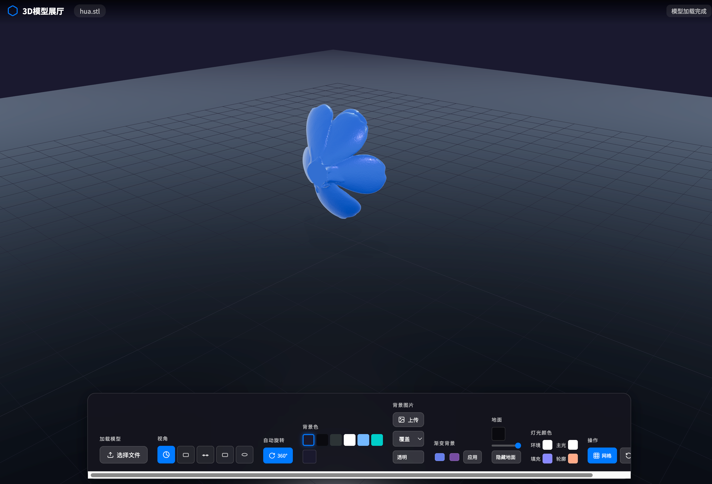

# Three.js 通用3D模型展厅

基于 Three.js 开发的通用3D模型展示应用，支持多种模型格式加载与交互式展示。

## 项目简介

这是一个功能完善的3D模型展厅应用，采用 TypeScript 开发，可加载和展示多种3D模型格式。具备颜色定制、视角控制、环境配置等丰富功能，适用于产品展示、3D模型预览等场景。
## 预览


在线预览
[https://github.com/vera-byte.github.io/3d_exhibition_hall/](https://github.com/vera-byte.github.io/3d_exhibition_hall/)

## 技术栈

| 技术 | 说明 |
|------|------|
| **Three.js** | 3D图形渲染引擎 |
| **TypeScript** | 类型安全的JavaScript超集 |
| **esbuild** | 高速构建工具 |
| **WebGL** | 浏览器底层图形API |

## 功能特性

### 📦 模型支持
- **GLTF/GLB** - glTF格式（Web推荐格式）
- **STL** - 3D打印常用格式
- **OBJ** - 通用3D模型格式
- **MTL** - OBJ材质文件

### 🎨 材质与外观
- 实时颜色切换
- 金属度/粗糙度调节
- 环境光遮蔽
- 阴影效果

### 📷 视角控制
- 预设视角（正面/侧面/背面/俯视）
- 360° 自动旋转
- 鼠标拖拽旋转、滚轮缩放
- 视角平滑过渡动画

### 🖼️ 环境配置
- 多种背景类型（纯色/渐变/图片/透明）
- 可调灯光系统（主光/补光/轮廓光）
- 地面网格/反射地面
- 环境贴图

### 📱 交互功能
- 拖拽上传模型
- 全屏查看模式
- 响应式设计
- 模型信息显示

## 项目结构

```
threejs-car-showroom/
├── index.html          # 主页面入口
├── main.ts             # TypeScript 源代码（开发用）
├── main.js             # 编译后的 JavaScript（生产用）
├── main.js.map         # Source Map 调试文件
├── style.css           # 样式文件
├── build.js            # esbuild 构建脚本
├── tsconfig.json       # TypeScript 配置
├── package.json        # 项目依赖配置
├── hua.stl             # 示例3D模型文件
├── README.md           # 项目说明文档
├── node_modules/       # 依赖包目录
└── old/                # 历史版本备份目录
```

### 核心文件说明

| 文件 | 说明 |
|------|------|
| `main.ts` | 核心业务逻辑，包含 `ModelViewer` 类 |
| `index.html` | HTML页面，包含Canvas容器和控制面板UI |
| `style.css` | 界面样式，包含暗色主题设计 |
| `build.js` | 自定义构建脚本，使用 esbuild |
| `tsconfig.json` | TypeScript 编译配置 |

## 快速开始

### 安装依赖

```bash
npm install
```

### 开发模式

监听文件变化，自动重新构建：

```bash
npm run dev
```

### 构建生产版本

```bash
npm run build
```

### 启动本地服务

```bash
npm run serve
# 或
npx serve .
```

然后在浏览器打开 http://localhost:3000

### 其他启动方式

#### Python HTTP 服务器

```bash
python3 -m http.server 8080
```

访问 http://localhost:8080

#### VS Code Live Server

1. 安装 Live Server 扩展
2. 右键 index.html → Open with Live Server

## 使用指南

### 加载模型

1. **拖拽上传**：将模型文件拖入页面指定区域
2. **预设模型**：点击控制面板中的模型选择器

### 控制面板功能

- **颜色选择**：点击颜色按钮切换模型颜色
- **视角切换**：选择预设视角或自定义视角
- **自动旋转**：开启/关闭模型自动旋转
- **全屏模式**：进入全屏查看
- **重置视角**：恢复到默认视角

## 浏览器支持

| 浏览器 | 最低版本 |
|--------|----------|
| Chrome | 90+ |
| Firefox | 90+ |
| Safari | 15+ |
| Edge | 90+ |

需要支持 WebGL 的现代浏览器。

## 项目配置

### TypeScript 配置 (tsconfig.json)

- 目标：ES2020
- 模块：ESNext
- 严格类型检查：启用
- 源码映射：启用

### 构建配置 (build.js)

- 入口：`main.ts`
- 输出：`main.js`
- 格式：ES Module
- 外部依赖：`three`

## 扩展开发

### 添加新的模型格式

在 `main.ts` 中导入对应的 Loader：

```typescript
import { XXXLoader } from 'three/addons/loaders/XXXLoader.js';
```

### 自定义 UI 控件

修改 `index.html` 中的控制面板 HTML 结构，然后在 `main.ts` 中添加相应的事件处理逻辑。

## 许可证

MIT License

## 参考资源

- [Three.js 官方文档](https://threejs.org/docs/)
- [glTF 格式规范](https://registry.khronos.org/glTF/)
- [TypeScript 官方文档](https://www.typescriptlang.org/docs/)
